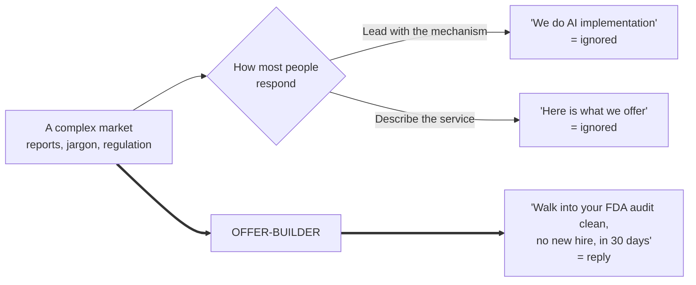
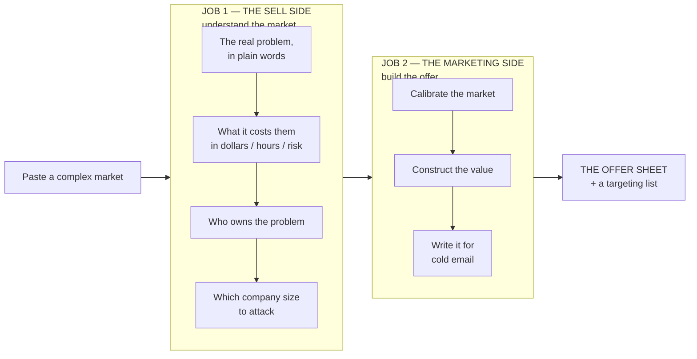
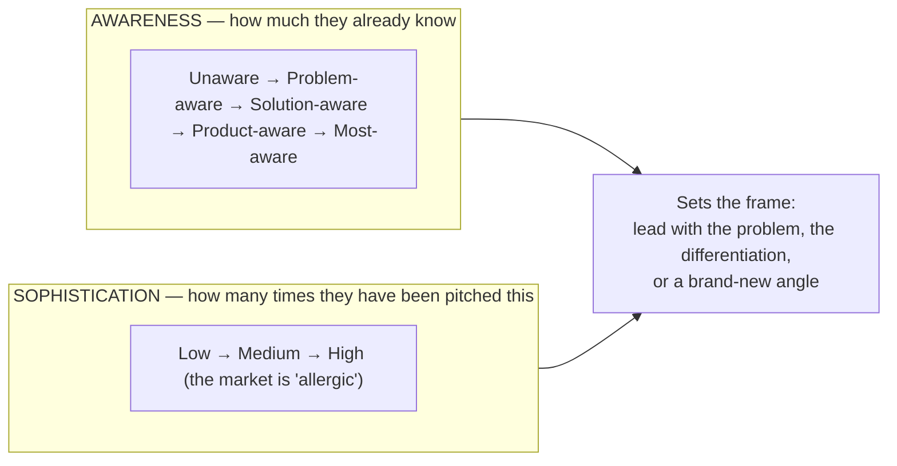
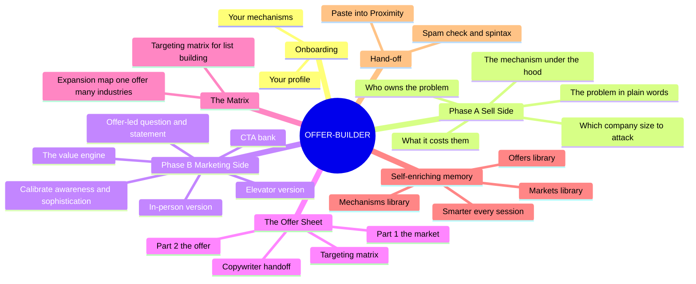
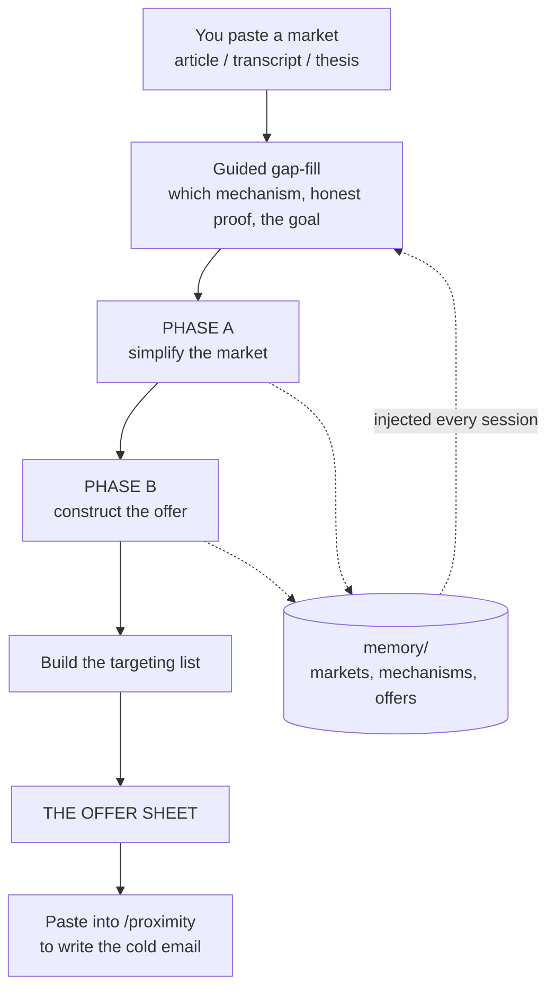
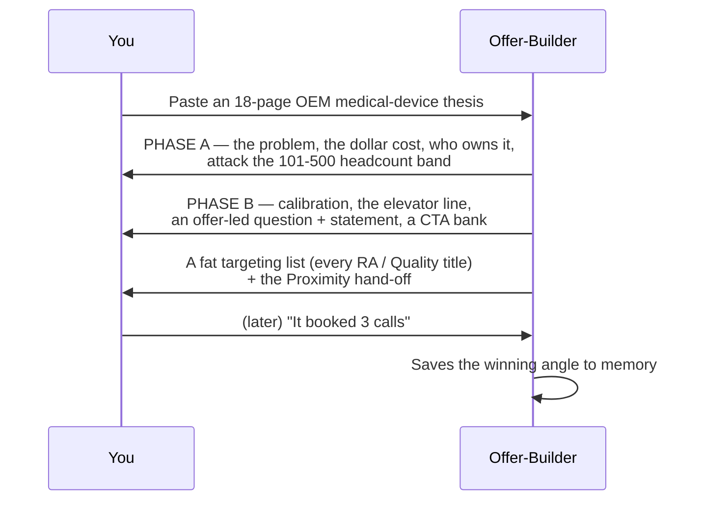
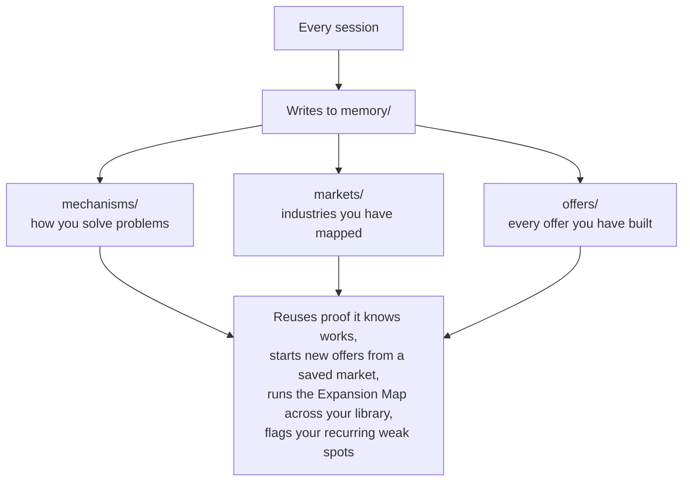

# Offer-Builder — The Complex-Market Offer Engine


[](LICENSE)
[](https://claude.ai/code)
[](https://github.com/termsheetinator)

**A Claude Code skill that turns a complicated market into a no-brainer offer you can take to cold email.** Paste a dense industry report, a vendor call transcript, or an AI-written thesis. Offer-Builder simplifies the market until you actually understand it, then builds an offer anchored to a real, expensive problem — and hands you a ready-to-paste targeting list. It builds the offer. It never writes the email.

```bash
curl -fsSL https://raw.githubusercontent.com/termsheetinator/offer-builder/main/install.sh | bash
```

One install. One two-minute onboarding. Then paste any market and get an offer.

---

## Table of Contents

- [What This Is](#what-this-is)
- [The Problem It Solves](#the-problem-it-solves)
- [Offer vs. Mechanism — the one idea everything rests on](#offer-vs-mechanism--the-one-idea-everything-rests-on)
- [The Two Jobs](#the-two-jobs)
- [The Offer Engine](#the-offer-engine)
- [The Full System — Mind Map](#the-full-system--mind-map)
- [What It Covers](#what-it-covers)
- [How It Works](#how-it-works)
- [The Offer Sheet — Anatomy of the Output](#the-offer-sheet--anatomy-of-the-output)
- [Worked Example — One Market, Start to Offer](#worked-example--one-market-start-to-offer)
- [The Targeting Matrix — Build the List](#the-targeting-matrix--build-the-list)
- [The Hand-Off — Where the Email Gets Written](#the-hand-off--where-the-email-gets-written)
- [Self-Enriching Memory](#self-enriching-memory)
- [When You'd Reach For It](#when-youd-reach-for-it)
- [Tips for Users](#tips-for-users)
- [Install](#install)
- [Update](#update)
- [Files](#files)
- [Requirements](#requirements)

---

## What This Is

Offer-Builder is a Claude Code skill that turns Claude into a **complex-market offer engine**. You bring a complicated market — an AI-written industry article, a recorded sales or vendor call, a dense research doc — and it does the two things that have to happen *before* a single cold email is written:

1. **It simplifies the market** so you understand the real problem, who owns it, what it costs them, and which companies to go after.
2. **It builds the offer** — the end result the buyer gets without the painful thing — and packages it so it survives a cold email.

The output is an **Offer Sheet**: the market explained in plain words, the offer written in forms you can actually say out loud, and a fat targeting list you can paste straight into your data tool. Then it points you to a copywriter skill to write the email.

It remembers your mechanisms, your markets, and every offer you build — so it gets sharper about your business every session.

> It is not a generic AI assistant with a clever prompt. It is a closed-loop offer system: **understand the market → build the offer → take it to cold email → learn what works → build the next one sharper.**

---

## The Problem It Solves

Most people walking into a sophisticated B2B market never get a reply — and it is almost always one of these three reasons:

- They **lead with the mechanism** ("we do GTM engineering / AI implementation / outbound") instead of the result.
- The market is so complex they **can't explain in plain words** what they even sell.
- Their "offer" is a **service description**, not a no-brainer — so it gets ignored.



Offer-Builder's entire job is to take you from the top row to the bottom row.

---

## Offer vs. Mechanism — the one idea everything rests on

People confuse the **mechanism** (how you solve the problem) with the **offer** (the result they get). Nobody buys the mechanism. They buy the painful problem going away.

| | The Mechanism (the *how*) | The Offer (the *what*) |
|---|---|---|
| Sounds like | "We build on-prem AI document systems" | "Walk into your next inspection clean, with no new hire" |
| Who cares | You and your engineers | The buyer who is personally on the hook |
| In a cold email | Ignored | Replied to |
| Where it lives | Under the hood | Front and center |

And the offer is always framed as **stopping a loss, not buying an upgrade**. People move for urgency, not desire. So every offer is anchored to a **gap** — the distance between where the buyer is and where they need to be — and priced *next to that gap*, so buying reads as avoiding an expensive loss.

> **You are a problem-solver, never a service provider.** The mechanism stays under the hood. The offer is always the end result, with the pain removed.

---

## The Two Jobs

Offer-Builder runs in two halves, and the order matters. You cannot build an offer for a market you do not understand.



---

## The Offer Engine

Once the market is understood, Offer-Builder constructs the offer with a proven value engine — then pushes every lever as far as it credibly goes.

**The value equation** — anchor to the result, then move every lever:

```
                 Dream outcome  ×  Perceived likelihood it works
   VALUE  =  ────────────────────────────────────────────────────
                 Time to result  ×  Effort  ×  Perceived cost
```

| Lever | Direction | What it means |
|---|---|---|
| **Dream outcome** | push up | The concrete result they want — a number wherever one exists |
| **Likelihood** | push up | Real proof and specificity, so they believe it will work |
| **Time** | push down | Lead with the *first* result, not full delivery (30 days beats 90) |
| **Effort** | push down | What the buyer has to do is as close to nothing as possible |
| **Cost** | push down | Anchored against the gap, so the price reads as loss avoided |

**Amplifiers** (added only when they are real): risk reversal / a fitting guarantee · one strong proof signal · genuine scarcity (capacity only) · genuine urgency (a real deadline).

**Calibration** — before constructing, it reads the market on two dials so the offer does not sound like every other email:



---

## The Full System — Mind Map

Everything ships in one skill file. No add-ons, no separate installs.



---

## What It Covers

```
━━━━━━━━━━━━━━━━━━━━━━━━━━━━━━━━━━━━━━━━━━━━━━━━━━━━━━━━━━━━━━
PHASE A — THE SELL SIDE        understand the market
━━━━━━━━━━━━━━━━━━━━━━━━━━━━━━━━━━━━━━━━━━━━━━━━━━━━━━━━━━━━━━
The problem                    the real pain, stripped to plain words
What it costs them             the gap as a number — dollars, hours, risk
The mechanism                  how you solve it, kept under the hood
Who owns the problem           the exact decision-maker titles who feel it
Size segmentation              6 headcount bands — and the ONE to attack
━━━━━━━━━━━━━━━━━━━━━━━━━━━━━━━━━━━━━━━━━━━━━━━━━━━━━━━━━━━━━━
PHASE B — THE MARKETING SIDE   build the no-brainer offer
━━━━━━━━━━━━━━━━━━━━━━━━━━━━━━━━━━━━━━━━━━━━━━━━━━━━━━━━━━━━━━
Calibration                    5 awareness stages x sophistication
The value engine               outcome, likelihood, time, effort, cost
The impact                     what actually changes — before and after
The elevator version           the offer in one line you can say out loud
Offer-led question + statement  two forms, each with its own CTA family
The CTA bank                    several low-friction closes, not just one
The in-person version          how to spark interest face to face
Make it stronger               how to push the offer to the next gear
━━━━━━━━━━━━━━━━━━━━━━━━━━━━━━━━━━━━━━━━━━━━━━━━━━━━━━━━━━━━━━
THE TARGETING MATRIX           build the cold-email list
━━━━━━━━━━━━━━━━━━━━━━━━━━━━━━━━━━━━━━━━━━━━━━━━━━━━━━━━━━━━━━
Fat title stacks               every title + acronym per problem-owner
Small-company collapse          founder / owner when the team is tiny
The search recipe              paste straight into Apollo / Clay / Ocean
━━━━━━━━━━━━━━━━━━━━━━━━━━━━━━━━━━━━━━━━━━━━━━━━━━━━━━━━━━━━━━
SELF-ENRICHING MEMORY          remembers across every session
━━━━━━━━━━━━━━━━━━━━━━━━━━━━━━━━━━━━━━━━━━━━━━━━━━━━━━━━━━━━━━
Mechanisms library             how you solve problems — reused across offers
Markets library                every industry you have mapped
Offers library                 every offer you have built
The Expansion Map              one offer, mapped across many industries
━━━━━━━━━━━━━━━━━━━━━━━━━━━━━━━━━━━━━━━━━━━━━━━━━━━━━━━━━━━━━━
```

---

## How It Works

1. **Install once** — run the curl command in your project directory.
2. **Onboard once** — `/offer-builder` captures your profile and the mechanisms you use (two minutes).
3. **Paste a market** — an article, a transcript, or a thesis, and say who you want to sell into.
4. **It builds the offer** — simplifies the market, constructs the offer, and writes the targeting list.
5. **It remembers** — every market, mechanism, and offer persists in `memory/` and makes the next build sharper.



You never pick a mode. You paste a market and it goes to work.

---

## The Offer Sheet — Anatomy of the Output

Every build produces one Offer Sheet — thorough but simple, in plain language, with enough on the page for you to learn from *and* for a copywriter to write from.

| Section | What you get |
|---|---|
| **Part 1 — The Market** | The problem, what it costs them, the mechanism, who you talk to, who owns it, and the one company-size band to attack |
| **Part 2 — The Offer** | Calibration, the impact, the elevator version, an offer-led question and statement, a CTA bank, the in-person version, and how to make it stronger |
| **The Targeting Matrix** | Fat title stacks + acronyms per owner, the small-company collapse, and a copy-paste database search recipe |
| **The Copywriter Hand-Off** | The forms to use, the one proof to lean on, an honesty guardrail, and the goal — everything the next agent needs |
| **Next Step** | The exact path to take the sheet into Proximity and turn it into a spam-checked cold email |

---

## Worked Example — One Market, Start to Offer

A real run: an 18-page thesis on **OEM medical-device manufacturers** (three candidate offers inside) goes in. Here is the shape of what comes out.



**The elevator version it produced:**

> "We get you inspection-ready post-market reports — without your team drowning in complaints or hiring another regulatory pro — with your first reports in 30 days, which means you walk into any FDA inspection clean and never miss a safety signal."

**The offer-led question (one of two forms):**

> "If you could cut complaint paperwork by ~70% and keep every report inspection-ready, without another hire — worth seeing how we did it for a similar regulated team?"

Plain enough for a ten-year-old. Anchored to a loss the buyer is already paying. Short enough to survive a cold email.

---

## The Targeting Matrix — Build the List

Half the battle in cold email is the list. So every Offer Sheet ends with a **fat targeting matrix** — built the way you would actually search a database, with every title variation and acronym, so your list is as big as it can accurately be.

```
Regulatory Affairs:   VP Regulatory Affairs · VP RA · Director of Regulatory
                      Affairs · Dir. RA · Head of Regulatory · Chief Regulatory Officer
Quality / QMS:        VP Quality · QA Director · Head of QMS · Quality Systems Manager
Post-Market / Safety: Head of Post-Market Surveillance · PMS Lead · Drug Safety Director
Small companies:      Founder · CEO · COO · Head of Ops  (they wear the hat)

Search recipe:        Boolean-OR all titles → industry = Medical Devices / IVD
                      → headcount 101-500 → keyword-boost QMSR, MDR, 510(k)
```

That is not just *who to target* — it is your list, ready to paste into Apollo, Clay, or Ocean.

---

## The Hand-Off — Where the Email Gets Written

Offer-Builder deliberately stops at the offer. Writing copy is a different craft, and there is a skill built for it. Every Offer Sheet ends with the exact next step:


Paste the whole Offer Sheet into a new [Proximity](https://github.com/termsheetinator/proximity-cold-email) session, let it write the email, check for spam words, spintax it, and check again. Then keep iterating — strong copy comes from going back and forth, not from one shot.

---

## Self-Enriching Memory

Offer-Builder is not a one-shot tool. It keeps three libraries on your machine and gets smarter every session.



Build a few offers and ask *"what other industries does this map to?"* — the **Expansion Map** takes one offer and shows you every adjacent market with the same gap. One offer, many industries.

Everything lives in local files on your machine. Nothing leaves.

---

## When You'd Reach For It

- **You just got an AI report on an industry you want to sell into.** Paste it. You get the market in plain words and an offer you can actually take to market.
- **You have a vendor or sales-call transcript full of jargon.** Paste it. It strips the complexity and finds the real, expensive problem.
- **You have a mechanism but no offer.** It turns "we build X" into "you never get the warning letter."
- **You have a working offer and want more reach.** Run the Expansion Map and get the next three industries to attack.
- **You are about to build a list.** The targeting matrix hands you every title and a search recipe.

---

## Tips for Users

- **Feed it the messy version.** The denser and more jargon-heavy the source, the more value it adds.
- **Be honest about your proof.** It will ask what is genuinely already in motion. Do not inflate it — the copywriter needs a real anchor, and a fabricated claim gets caught fast.
- **Build several offers, then run the Expansion Map.** One offer usually maps to many industries.
- **It will not write your email — by design.** Take the Offer Sheet to [`/proximity`](https://github.com/termsheetinator/proximity-cold-email).

---

## Install

```bash
curl -fsSL https://raw.githubusercontent.com/termsheetinator/offer-builder/main/install.sh | bash
```

Then open Claude Code in that directory and type `/offer-builder`. The first run sets up your profile (two minutes, once).

## Update

Re-run the same command to pull the latest version. Your memory is preserved.

```bash
curl -fsSL https://raw.githubusercontent.com/termsheetinator/offer-builder/main/install.sh | bash
```

---

## Files

| File | What it does |
|---|---|
| `SKILL.md` | The skill itself — installs to `~/.claude/skills/offer-builder/SKILL.md` |
| `install.sh` | One-command installer — skill, hook, memory, settings |
| `.claude/hooks/offer-builder-active.sh` | Injects your memory into every session |
| `.claude/settings.json` | Wires the hook to `UserPromptSubmit` |
| `memory/` | Your profile + mechanisms / markets / offers libraries (local only) |
| `public/` | Banner and image assets |
| `LICENSE` | MIT |

---

## Requirements

- [Claude Code](https://claude.com/claude-code)
- An Anthropic account

---

<p align="center">
  <sub>Part of <a href="https://infrasuite.co">InfraSuite</a> · Built by <a href="https://advisoryincubator.com">Advisory Incubator™</a></sub>
</p>
